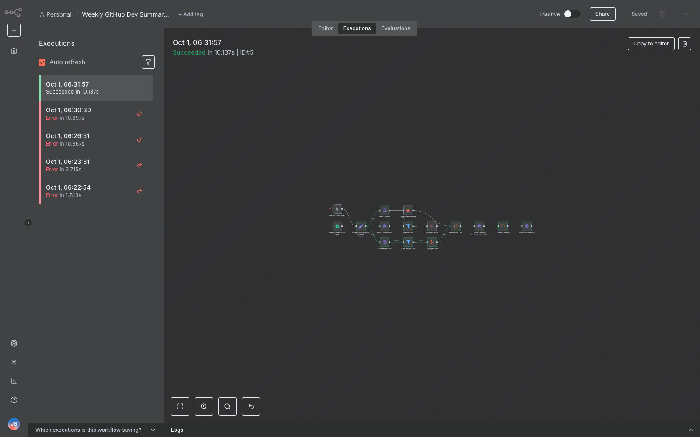

# Weekly GitHub Dev Summary — n8n workflow

An n8n workflow that generates a weekly narrative summary of a GitHub repository's
activity using the Claude API and delivers it to a Discord/Slack webhook.

## What it does

- Trigger: weekly schedule (Friday 5pm), plus a manual trigger for testing
- Fetches from the GitHub API: commits, closed issues and merged PRs for the week
- Calls the Claude API (`claude-sonnet-4-20250514`) to generate a narrative summary
- Delivers the summary via a Discord/Slack webhook (POST `{"content": ...}`)
- Configurable variables (the **Config** node): GitHub repo, webhook URL, language (EN/FR)

## Setup (5 steps)

1. Install n8n and open the editor (`npx n8n`, then `http://localhost:5678`).
2. Import `weekly-github-dev-summary.json`: Workflows → ⋯ → Import from file.
3. In the **Config** node, set `repo`, `webhook_url` and `language`.
4. Create a header-auth credential (`httpHeaderAuth`) with `Authorization: Bearer <your-anthropic-key>`
   and select it in the **Claude Summary** node (the node also sends `anthropic-version: 2023-06-01`).
5. Click **Execute workflow** to test, then activate the workflow for the weekly run.

## Files

- `weekly-github-dev-summary.json` — the exportable n8n workflow
- `execution-success.png` — the workflow's executions panel on a real local n8n instance,
  showing the end-to-end run that succeeded (GitHub fetches real, summary generated,
  webhook delivered)

## Test note

The screenshot's run used a local OpenAI-compatible endpoint as the summary model
(the machine has no Anthropic key); the shipped workflow JSON targets the real
Anthropic Messages API — only the **Claude Summary** node's URL/credential changes.
